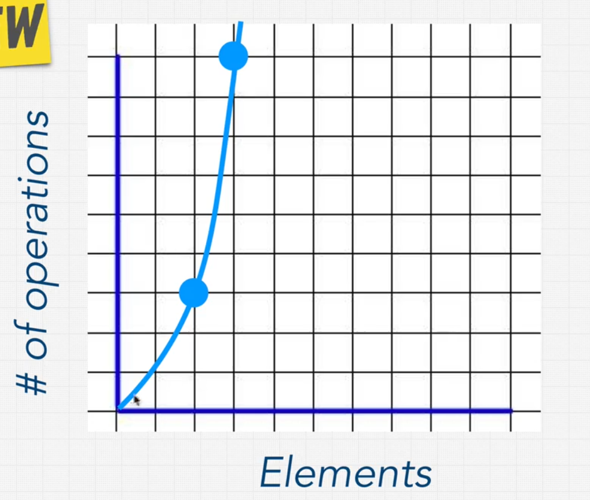
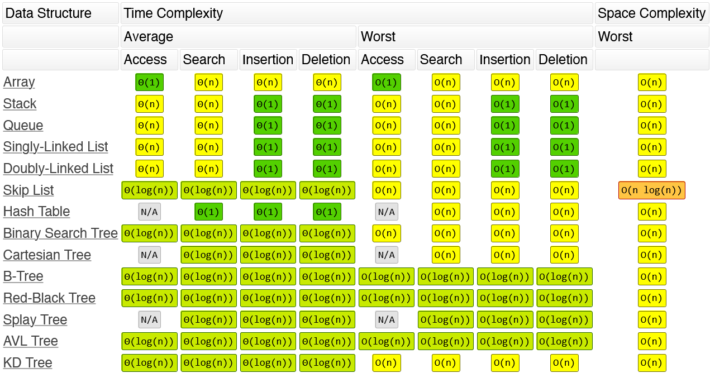
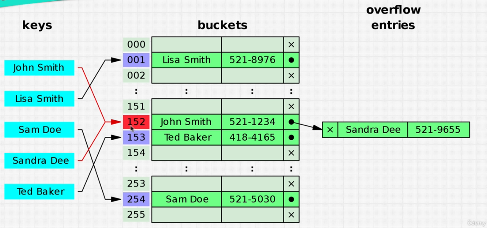

# python data structures and algorithms

## 1. BIG O:
  `it's all about messure scalability [for speed(CPU) and space(RAM)]: when the input increase, what will be the output. else it's about readability`
   

### 1.1 time complexity
  ### time complexity chart for all Big O types  
  

  * `O(1):` Constant time. The algorithm takes the same amount of time to execute, regardless of the size of the input data set.
  .png)

  * `O(log n):` Logarithmic time. The execution time of the algorithm increases logarithmically as the input size increases. Binary search is a classic example of an algorithm that runs in logarithmic time.

  * `O(n):` Linear time. The execution time of the algorithm increases linearly with the increase in input size. For example, a loop that goes through each element of an array once exhibits linear time complexity.
  .png)
  
  * `O(n log n):` Linearithmic time. This time complexity is common in algorithms that break the problem into smaller subproblems, solve them independently, and then combine their solutions, such as in merge sort and quick sort.

  * `O(n^2):` Quadratic time. The execution time of the algorithm is proportional to the square of the input size. Algorithms with nested loops over the input data often have quadratic time complexity, like the bubble sort algorithm.
  

  * `O(2^n):` Exponential time. The execution time of the algorithm doubles with each addition to the input data set. An example would be certain * naive solutions to the travelling salesman problem.

  * `O(n!):` Factorial time. The execution time of the algorithm grows factorialy with the increase in input size. Algorithms that generate all possible permutations of a set fall into this category.

#### 1.2 rules of Calculating BIG N
  * ##### 1. Worst case 
  * ##### 2. Remove constants 
  * ##### 3. Different inputs should have different variables. O(a*+b). A and B arrays nested would be O(a*b), + for steps in order, * for nested steps
  * ##### 4. remove Drop None Dominant
  
### 1.3 space complexity (What causes Space complexity?)
  * ##### 1. Variables
  * ##### 2. Data Structures
  * ##### 3. Function Call
  * ##### 4. Allocations
______________________________________________________

## 2. Data Structure:
  `A data structure is a specialized format for organizing, processing, retrieving and storing data. There are several basic and advanced types of data structures`
  ### operations on data structure:
  * Traverse
  * Insertion
  * Deletion
  * Searching
  * Sorting
  * Access/lookup
  * Merging 

  

  ### ARRAYS :
  `Arrays are fundamental data structures used in programming to store sequences of elements. They come in two main types: static and dynamic arrays, each with its own set of advantages and disadvantages.`
  * `Static Arrays :`  static array has a fixed size, which means the number of elements it can hold is determined at the time of its creation. Its   size cannot be altered once it is allocated.
    *  `Pros`:
        * Performance: Accessing elements in a static array is fast because elements are stored in contiguous memory locations. This allows for efficient indexing, where the memory address of any element can be directly calculated.
        *  Simplicity: Static arrays are straightforward to implement and use. They are suitable for scenarios where the maximum size is known ahead of time and doesn't change.
    
    *  `Cons`:

        * Fixed Size: The main disadvantage is the inability to resize the array. If the array is too large, it wastes memory. If it's too small, it can't hold all the elements needed.
        *  Inflexibility: You must know the maximum number of elements in advance, which is not always practical. Adjusting the size of a static array requires creating a new array and copying the old elements to it, which is inefficient.

   * `Dynamic Arrays :`  A dynamic array can change its size during runtime. It allocates more memory than initially needed, and if  this capacity is exceeded, it reallocates the array with a larger size and copies the elements.
      
      *  `Pros`:
          * Flexibility: Dynamic arrays can grow and shrink as needed at runtime, making them more versatile for situations where the number of elements is not known in advance.
          * Ease of Use: They provide the convenience of not having to specify the size ahead of time and managing fewer memory allocation errors due to exceeded capacity.
          * Efficient Memory Usage: By resizing, dynamic arrays can manage memory more efficiently compared to a static array that might allocate too much unnecessary space.
      
      
      *  `Pros`:
          * Performance Overhead: Resizing a dynamic array involves allocating new memory and copying elements from the old array, which can be a costly operation in terms of performance.
          * Complexity: The implementation of dynamic arrays is more complex than static arrays because it needs to handle resizing logic.
          * Slightly Slower Access: While element access remains generally fast, the added layer of abstraction and potential for non-contiguous memory allocation can make element access slightly slower than in static arrays.
  
  ### Hash Table, Maps, Hash Maps, object or dictionary:
  `A hash table, also known as a dictionary or hash map in various programming languages, is a data structure that implements an associative array abstract data type, a structure that can map keys to values. It uses a hash function to compute an index into an array of buckets or slots, from which the desired value can be found. Ideally, the hash function will assign each key to a unique bucket, but this situation is rarely achievable in practice.`

  * Key Characteristics
    * `Efficiency`: One of the main advantages of hash tables is their ability to provide fast data retrieval. `The average time complexity for both searching for an existing key, inserting a new key, deleting a key is typically close to O(1)`, under the assumption that the hash function is good and maintains a low collision rate.

    * `Handling Collisions`: Since a hash function might map more than one key to the same bucket, hash tables use collision resolution methods, such as chaining (where each bucket contains a list of all elements hashed to it) or open addressing (where a collision triggers a probing sequence to find where to store the value).
      

    * `Dynamic Resizing`: To maintain efficient operations, hash tables may resize themselves based on the number of elements stored. This involves rehashing all existing entries, which can be computationally expensive but is infrequent.
  
  ### linked list:
    
  `A linked list is a fundamental data structure used in computer science to organize items sequentially, with each item pointing to the next one in the sequence. It's particularly useful in scenarios where efficient insertion and deletion of elements are necessary. Unlike arrays, linked lists do not require continuous memory space. Here are the primary types of linked lists:`

  * `Single Linked List:` A single linked list consists of nodes where each node contains data and a reference (or link) to the next node in the sequence. The first node is called the `head`, and the last node, which points to null, signifies the end of the list. Single linked lists only allow traversal in one direction: from the head towards the last node.

    

  * `Double Linked List :` A double (or doubly) linked list extends the single linked list by allowing traversal in both directions. Each node in a double linked list contains three components: data, a reference to the next node, and a reference to the previous node. The head's previous link is null, as is the next link of the last node, clearly defining the list's boundaries.
    
    
